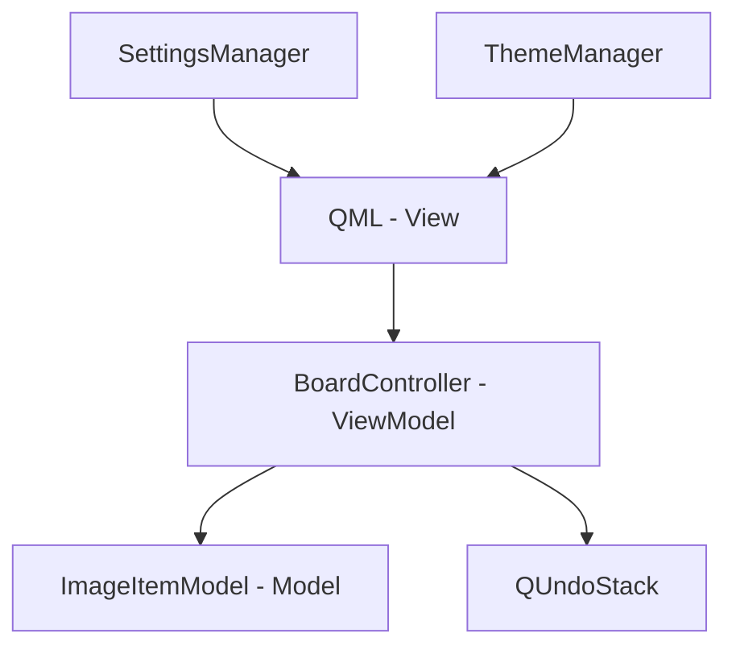
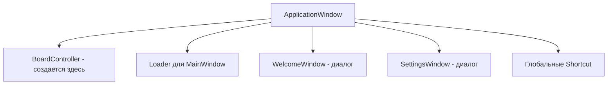
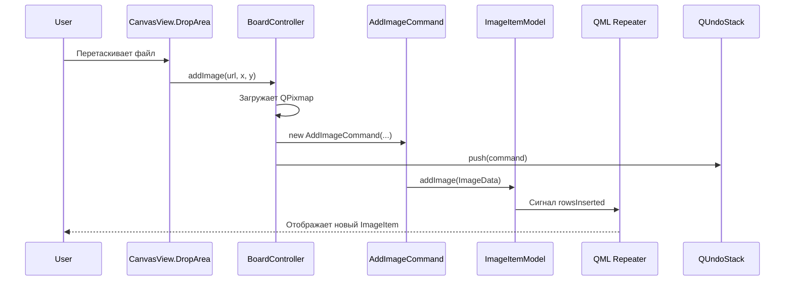
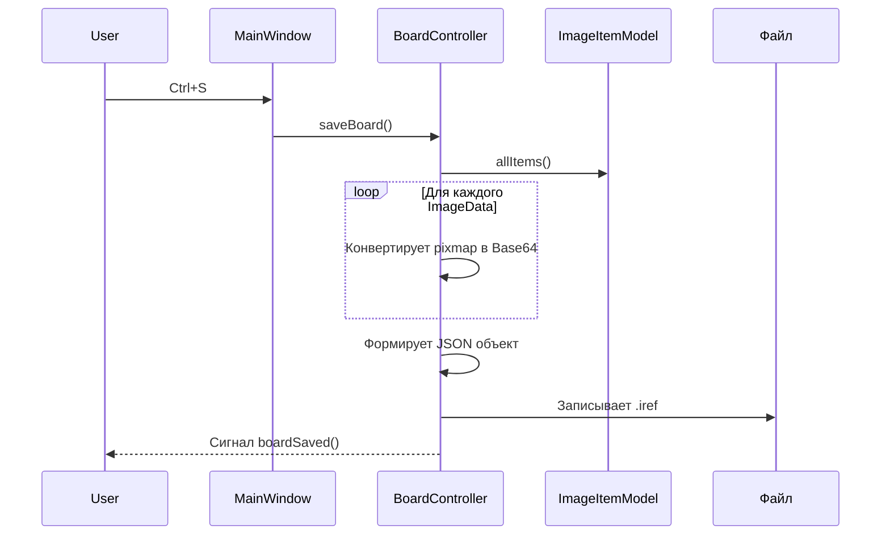
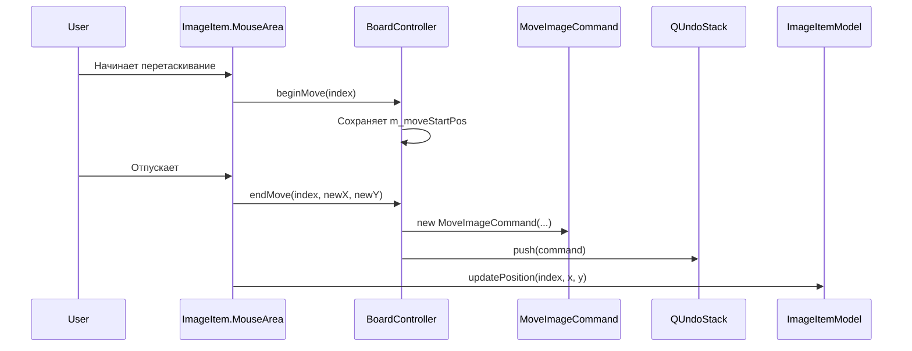

# Шпаргалка по коду ImagoRef

Этот документ содержит полный обзор структуры и логики работы проекта ImagoRef — приложения для создания досок с референсами.

---

## Обзор проекта

| Параметр | Значение |
|----------|----------|
| **Фреймворк** | Qt6 (Qt Quick / QML) |
| **Поддерживаемые ОС** | macOS, Windows, Linux |
| **Архитектура** | MVVM-подобная |
| **Язык бэкенда** | C++17 |
| **Система сборки** | CMake |
| **Формат файлов** | `.iref` (JSON с изображениями в Base64) |

### Архитектура MVVM



- **View**: QML файлы отвечают за UI (Main.qml, MainWindow.qml, компоненты)
- **ViewModel**: `BoardController` связывает QML с данными, управляет логикой
- **Model**: `ImageItemModel` хранит список изображений и их свойства

---

## Структура директорий

```
ImagoRef/
├── src/
│   ├── main.cpp              # Точка входа приложения
│   ├── backend/              # C++ бэкенд (логика и данные)
│   │   ├── BoardController.h/.cpp
│   │   ├── ImageItemModel.h/.cpp
│   │   ├── SettingsManager.h/.cpp
│   │   ├── ThemeManager.h/.cpp
│   │   └── UndoCommands.h/.cpp
│   └── qml/                  # QML интерфейс
│       ├── Main.qml
│       ├── MainWindow.qml
│       ├── WelcomeWindow.qml
│       ├── SettingsWindow.qml
│       └── components/
│           ├── CanvasView.qml
│           ├── ImageItem.qml
│           ├── FloatingToolbar.qml
│           ├── ImagoToolButton.qml
│           └── ResizeHandles.qml
├── res/                      # Ресурсы (иконки, темы)
├── docs/                     # Документация
├── packs/                    # Конфигурации сборки
└── CMakeLists.txt            # Файл сборки
```

---

## Точка входа (`src/main.cpp`)

```cpp
int main(int argc, char *argv[])
```

### Последовательность запуска

1. Создание `QGuiApplication` и установка метаинформации
2. Установка стиля Qt Quick Controls (`Basic`)
3. Загрузка настроек через `SettingsManager::instance()`
4. Применение темы через `ThemeManager::instance()`
5. Создание `QQmlApplicationEngine`
6. Регистрация синглтонов `Settings` и `Theme` в контексте QML
7. Загрузка `Main.qml`

### Регистрация типов для QML

Типы регистрируются через макросы `QML_ELEMENT` и `QML_SINGLETON` в заголовочных файлах:

| Класс | Макрос | Доступ в QML |
|-------|--------|--------------|
| `BoardController` | `QML_ELEMENT` | Создается в `Main.qml` |
| `ImageItemModel` | `QML_ELEMENT` | Через `controller.model` |
| `SettingsManager` | `QML_SINGLETON` | Через контекст `Settings` |
| `ThemeManager` | `QML_SINGLETON` | Через контекст `Theme` |

---

## Backend C++ (`src/backend/`)

### BoardController

**Файлы**: `BoardController.h`, `BoardController.cpp`

**Роль**: Главный контроллер приложения, связывающий QML и C++. Управляет холстом, файловыми операциями и инструментами.

#### Q_PROPERTY (доступны из QML)

| Свойство | Тип | Описание |
|----------|-----|----------|
| `model` | `ImageItemModel*` | Модель изображений (read-only) |
| `currentFilePath` | `QString` | Путь к текущему файлу доски |
| `windowTitle` | `QString` | Заголовок окна (зависит от имени файла) |
| `canUndo` | `bool` | Можно ли отменить действие |
| `canRedo` | `bool` | Можно ли повторить действие |
| `gridSize` | `int` | Размер сетки в пикселях |
| `hasSelection` | `bool` | Есть ли выделенные элементы |

#### Q_INVOKABLE методы (вызываются из QML)

**Файловые операции:**

| Метод | Описание |
|-------|----------|
| `openBoard(QUrl fileUrl)` | Открывает доску из файла `.iref` |
| `saveBoard()` | Сохраняет доску в текущий файл |
| `saveBoardAs(QUrl fileUrl)` | Сохраняет доску как новый файл |
| `newBoard()` | Создает новую пустую доску |

**Операции с изображениями:**

| Метод | Описание |
|-------|----------|
| `addImage(QUrl, qreal x, qreal y)` | Добавляет изображение по URL |
| `addImageFromPixmap(QByteArray, x, y)` | Добавляет изображение из данных |
| `pasteFromClipboard(qreal x, qreal y)` | Вставляет изображение из буфера обмена |

**Выделение:**

| Метод | Описание |
|-------|----------|
| `selectItem(int index, bool addToSelection)` | Выделяет элемент (с Ctrl — добавление к выделению) |
| `selectAll()` | Выделяет все элементы |
| `clearSelection()` | Сбрасывает выделение |

**Инструменты:**

| Метод | Описание |
|-------|----------|
| `deleteSelected()` | Удаляет выделенные элементы |
| `snapToGrid()` | Привязывает выделенные элементы к сетке |
| `rotateSelected(qreal angleDelta)` | Поворачивает выделенные элементы на угол |

**Undo/Redo:**

| Метод | Описание |
|-------|----------|
| `undo()` | Отменяет последнее действие |
| `redo()` | Повторяет отмененное действие |
| `beginMove(int index)` | Запоминает начальную позицию перед перемещением |
| `endMove(int, qreal newX, qreal newY)` | Создает команду undo после перемещения |
| `beginResize(int index)` | Запоминает начальный размер перед изменением |
| `endResize(int, x, y, w, h)` | Создает команду undo после изменения размера |

#### Сигналы

| Сигнал | Когда испускается |
|--------|-------------------|
| `filePathChanged()` | Изменился путь к файлу |
| `undoStateChanged()` | Изменилось состояние canUndo |
| `redoStateChanged()` | Изменилось состояние canRedo |
| `gridSizeChanged()` | Изменился размер сетки |
| `selectionChanged()` | Изменилось выделение |
| `boardLoaded()` | Доска загружена |
| `boardSaved()` | Доска сохранена |

---

### ImageItemModel

**Файлы**: `ImageItemModel.h`, `ImageItemModel.cpp`

**Роль**: Модель данных (`QAbstractListModel`), хранящая список изображений на холсте. Используется `Repeater` в QML для отображения изображений.

#### Структура ImageData

```cpp
struct ImageData {
    QString id;       // Уникальный идентификатор
    QUrl source;      // Путь к изображению
    QPixmap pixmap;   // Оригинальный пиксмап
    qreal x, y;       // Позиция
    qreal width, height;  // Размеры
    qreal rotation;   // Угол поворота (градусы)
    qreal zValue;     // Z-index (слой)
    bool selected;    // Статус выделения
};
```

#### Роли модели (для QML)

| Роль | Имя в QML | Тип |
|------|-----------|-----|
| `IdRole` | `itemId` | `QString` |
| `SourceRole` | `source` | `QUrl` |
| `XRole` | `modelX` | `qreal` |
| `YRole` | `modelY` | `qreal` |
| `WidthRole` | `modelWidth` | `qreal` |
| `HeightRole` | `modelHeight` | `qreal` |
| `RotationRole` | `modelRotation` | `qreal` |
| `ZValueRole` | `zValue` | `qreal` |
| `SelectedRole` | `selected` | `bool` |

#### Q_INVOKABLE методы

| Метод | Описание |
|-------|----------|
| `updatePosition(int index, qreal x, qreal y)` | Обновляет позицию элемента |
| `updateSize(int index, qreal w, qreal h)` | Обновляет размер элемента |
| `updateRotation(int index, qreal rotation)` | Обновляет угол поворота |
| `setSelected(int index, bool selected)` | Устанавливает статус выделения |
| `clearSelection()` | Сбрасывает выделение всех элементов |
| `selectedIndices()` | Возвращает список индексов выделенных элементов |

---

### SettingsManager

**Файлы**: `SettingsManager.h`, `SettingsManager.cpp`

**Роль**: Singleton для управления настройками приложения. Использует `QSettings` для хранения.

#### Q_PROPERTY

| Свойство | Тип | Описание |
|----------|-----|----------|
| `themeName` | `QString` | Имя текущей темы |
| `gridSize` | `int` | Размер сетки |

#### Методы

| Метод | Описание |
|-------|----------|
| `instance()` | Возвращает единственный экземпляр |
| `loadSettings()` | Загружает настройки из системного хранилища |
| `saveSettings()` | Сохраняет настройки |

---

### ThemeManager

**Файлы**: `ThemeManager.h`, `ThemeManager.cpp`

**Роль**: Singleton для управления темами приложения. Предоставляет цвета для QML через Q_PROPERTY.

#### Q_PROPERTY (цвета текущей темы)

| Свойство | Описание |
|----------|----------|
| `currentTheme` | Имя текущей темы |
| `backgroundColor` | Цвет фона |
| `textColor` | Цвет текста |
| `accentColor` | Акцентный цвет |
| `accentHoverColor` | Акцентный цвет при наведении |
| `accentPressedColor` | Акцентный цвет при нажатии |
| `iconColor` | Цвет иконок |
| `gridColor` | Цвет сетки |
| `borderColor` | Цвет границ |
| `panelColor` | Цвет панелей |
| `controlBackground` | Цвет фона элементов управления |

#### Q_INVOKABLE методы

| Метод | Описание |
|-------|----------|
| `applyTheme(QString themeName)` | Применяет тему по имени |
| `colorizeSvg(QString path, QColor, QSize)` | Перекрашивает SVG иконку |

#### Доступные темы

`imago`, `dark`, `light`, `blue`, `aquamarine`, `green`, `purple`, `pink`, `orange`

---

### UndoCommands

**Файлы**: `UndoCommands.h`, `UndoCommands.cpp`

**Роль**: Классы команд для системы Undo/Redo (`QUndoStack`).

| Класс | Описание |
|-------|----------|
| `AddImageCommand` | Добавление изображения |
| `RemoveImageCommand` | Удаление изображений |
| `MoveImageCommand` | Перемещение (поддерживает merge) |
| `ResizeImageCommand` | Изменение размера и позиции |
| `RotateImageCommand` | Вращение |

Каждая команда реализует `undo()` и `redo()` для отмены/повтора действия.

---

## Frontend QML (`src/qml/`)

### Main.qml

**Роль**: Главная точка входа QML. Координирует показ окон.

#### Структура



#### Поток запуска

1. При старте открывается `WelcomeWindow`
2. Пользователь выбирает "Создать" или "Открыть"
3. `mainLoader.active = true` загружает `MainWindow`
4. `WelcomeWindow` закрывается

#### Горячие клавиши (глобальные)

| Комбинация | Действие |
|------------|----------|
| `Ctrl+O` | Открыть файл |
| `Ctrl+S` | Сохранить |
| `Ctrl+Shift+S` | Сохранить как |
| `Ctrl+,` | Открыть настройки |

---

### MainWindow.qml

**Роль**: Главное окно приложения с холстом и панелью инструментов.

#### Компоненты

- `CanvasView` — бесконечный холст (z: 0)
- `FloatingToolbar` — плавающая панель инструментов (z: 100)
- `FileDialog` × 2 — открытие и сохранение

#### Горячие клавиши

| Комбинация | Действие |
|------------|----------|
| `Tab` | Показать/скрыть панель инструментов |
| `Delete`/`Backspace` | Удалить выделенные |
| `Ctrl+V` | Вставить из буфера |
| `Ctrl+G` | Привязать к сетке |
| `Ctrl+R` | Повернуть на 90° по часовой |
| `Ctrl+Shift+R` | Повернуть на 90° против часовой |
| `Ctrl+Z` | Отменить |
| `Ctrl+Shift+Z` | Повторить |
| `Ctrl++` | Приблизить |
| `Ctrl+-` | Отдалить |
| `Escape` | Сбросить выделение и режим ресайза |
| `Ctrl+E` | Режим изменения размера |
| `Ctrl+A` | Выделить все |

---

### CanvasView.qml

**Роль**: Реализация "бесконечного" холста с масштабированием и панорамированием.

#### Свойства

| Свойство | Тип | Описание |
|----------|-----|----------|
| `controller` | `BoardController` | Контроллер доски (required) |
| `zoomLevel` | `real` | Текущий масштаб (0.1 — 5.0) |
| `resizeMode` | `bool` | Режим изменения размера |

#### Публичные методы

| Метод | Описание |
|-------|----------|
| `zoomIn()` | Увеличить масштаб на 15% |
| `zoomOut()` | Уменьшить масштаб на 15% |
| `setZoom(newZoom, center)` | Установить масштаб с центром |
| `mapToScene(point)` | Преобразовать координаты экрана в координаты сцены |
| `toggleResizeMode()` | Переключить режим ресайза |
| `exitResizeMode()` | Выйти из режима ресайза |

#### Структура слоев

| Z-index | Содержимое |
|---------|------------|
| 0 | `backgroundClickArea` — клик для сброса выделения |
| 1 | `gridLayer` — сетка точек |
| 10+ | `ImageItem` — изображения (по порядку добавления) |

#### Как работает

1. **Flickable** с огромным размером контента (10000×10000) для виртуального пространства
2. **Масштабирование**: `sceneContainer.scale = zoomLevel`
3. **Панорамирование**: средняя кнопка мыши меняет `contentX/Y`
4. **Сетка**: `Repeater` создает точки только в видимой области

---

### ImageItem.qml

**Роль**: Визуальный компонент одного изображения на холсте.

#### Свойства

| Свойство | Тип | Описание |
|----------|-----|----------|
| `itemIndex` | `int` | Индекс в модели |
| `imageSource` | `url` | URL изображения |
| `itemWidth`, `itemHeight` | `real` | Размеры |
| `selected` | `bool` | Выделено ли |
| `resizeMode` | `bool` | Режим ресайза |
| `zoomLevel` | `real` | Текущий масштаб (для корректной толщины рамки) |

#### Функциональность

- Отображение картинки (`Image`)
- Рамка выделения (белая, 2px)
- Перетаскивание (`MouseArea.drag`)
- Выделение (клик, Ctrl+клик для множественного)
- Маркеры изменения размера (`ResizeHandles`)

#### Интеграция с Undo

1. `onPressed` — вызывает `controller.beginMove()`
2. `onReleased` — если позиция изменилась, вызывает `controller.endMove()` и обновляет модель

---

### FloatingToolbar.qml

**Роль**: Плавающая панель инструментов слева.

#### Сигналы

| Сигнал | Описание |
|--------|----------|
| `settingsClicked()` | Нажата кнопка настроек |
| `openClicked()` | Нажата кнопка открыть |
| `saveClicked()` | Нажата кнопка сохранить |
| `saveAsClicked()` | Нажата кнопка сохранить как |
| `zoomInClicked()` | Нажата кнопка приблизить |
| `zoomOutClicked()` | Нажата кнопка отдалить |
| `resizeModeClicked()` | Нажата кнопка режима ресайза |

#### Кнопки (сверху вниз)

1. Открыть, Сохранить, Сохранить как
2. Вставить, Удалить
3. Привязать к сетке, Режим ресайза, Вращать влево/вправо
4. Приблизить, Отдалить
5. Undo, Redo
6. Настройки

---

### ResizeHandles.qml

**Роль**: 8 маркеров изменения размера для `ImageItem`.

#### Маркеры

```
0 — 1 — 2
|       |
7       3
|       |
6 — 5 — 4
```

#### Функциональность

- **Shift** — сохранение пропорций
- Минимальный размер: 20×20 пикселей
- Автоматическое масштабирование маркеров относительно зума

---

### WelcomeWindow.qml

**Роль**: Стартовый диалог приложения.

#### Сигналы

| Сигнал | Описание |
|--------|----------|
| `newBoardRequested()` | Нажата кнопка "Создать" |
| `openBoardRequested(url fileUrl)` | Выбран файл для открытия |

#### Содержимое

- Логотип
- Заглушки для недавних проектов (5 штук)
- Кнопки "Создать" и "Открыть"

---

### SettingsWindow.qml

**Роль**: Диалог настроек приложения.

#### Страницы

1. **Общие**
   - Шаг сетки (SpinBox, 20-200 px)
   - Тема интерфейса (ComboBox)

2. **Горячие клавиши**
   - Справочник по всем комбинациям клавиш

---

## Основные алгоритмы

### 1. Добавление изображения (Drag & Drop)



### 2. Сохранение доски



### 3. Перемещение изображения с Undo



---

## Формат файла .iref

Файл `.iref` — это JSON-документ:

```json
{
  "version": 1,
  "gridSize": 50,
  "images": [
    {
      "id": "img_1",
      "x": 100.0,
      "y": 200.0,
      "width": 300.0,
      "height": 200.0,
      "rotation": 0.0,
      "zValue": 0.0,
      "data": "iVBORw0KGgo...base64..."
    }
  ]
}
```

---

## Горячие клавиши (полный список)

### Навигация

| Комбинация | Действие |
|------------|----------|
| Средняя кнопка мыши | Панорамирование |
| `Ctrl` + Колесико | Масштабирование |
| `Ctrl` + `+` | Приблизить |
| `Ctrl` + `-` | Отдалить |
| `Ctrl` + `G` | Привязать к сетке |

### Управление элементами

| Комбинация | Действие |
|------------|----------|
| `Ctrl` + `V` | Вставить из буфера |
| `Delete` / `Backspace` | Удалить выделенные |
| `Ctrl` + `Z` | Отменить |
| `Ctrl` + `Shift` + `Z` | Повторить |
| `Ctrl` + `A` | Выделить все |
| `Escape` | Сбросить выделение |

### Трансформации

| Комбинация | Действие |
|------------|----------|
| `Ctrl` + `E` | Режим изменения размера |
| `Ctrl` + `R` | Вращать на 90° по часовой |
| `Ctrl` + `Shift` + `R` | Вращать на 90° против часовой |
| `Shift` (при ресайзе) | Сохранять пропорции |

### Файлы

| Комбинация | Действие |
|------------|----------|
| `Ctrl` + `O` | Открыть |
| `Ctrl` + `S` | Сохранить |
| `Ctrl` + `Shift` + `S` | Сохранить как |

### Интерфейс

| Комбинация | Действие |
|------------|----------|
| `Tab` | Скрыть/показать панель |
| `Ctrl` + `,` | Открыть настройки |

### Сборка проекта

```cmake -B build```

```cmake --build build -j$(sysctl -n hw.ncpu)```

```./build/ImagoRef.app/Contents/MacOS/ImagoRef```
